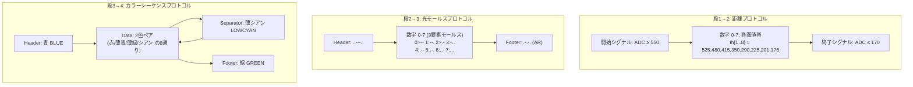
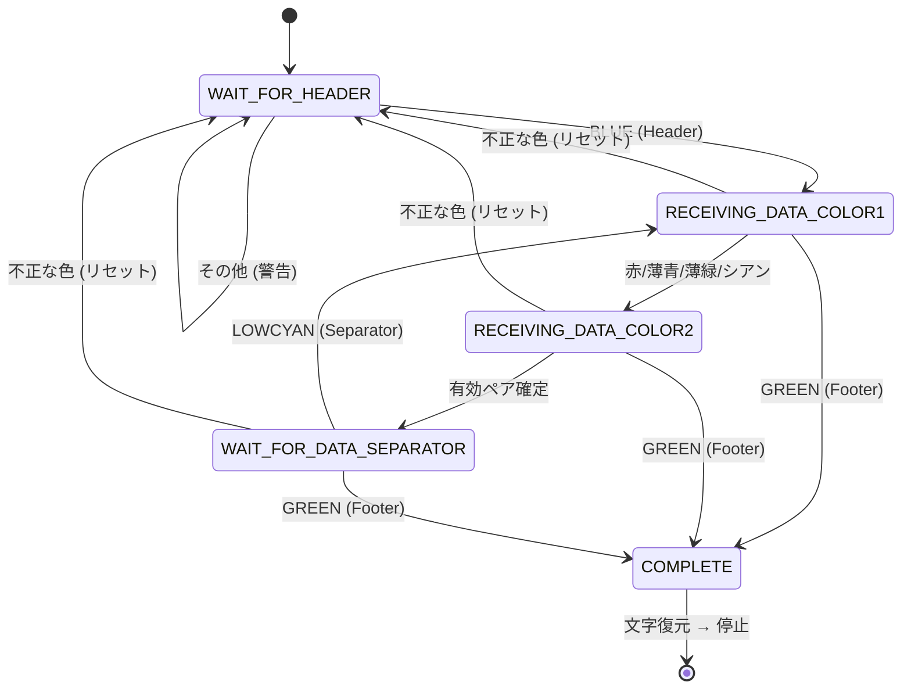
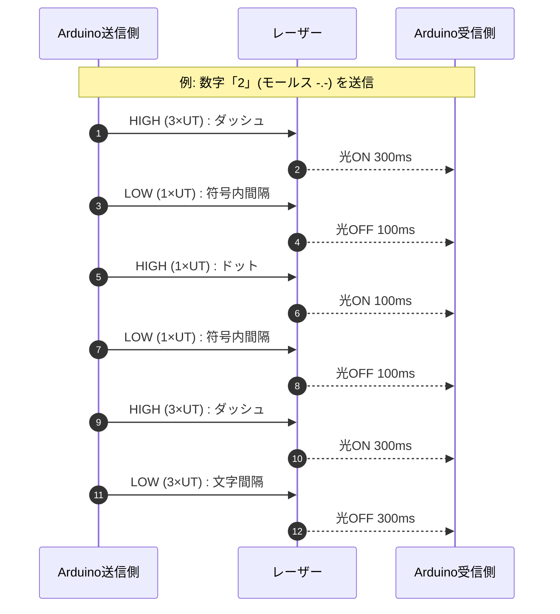
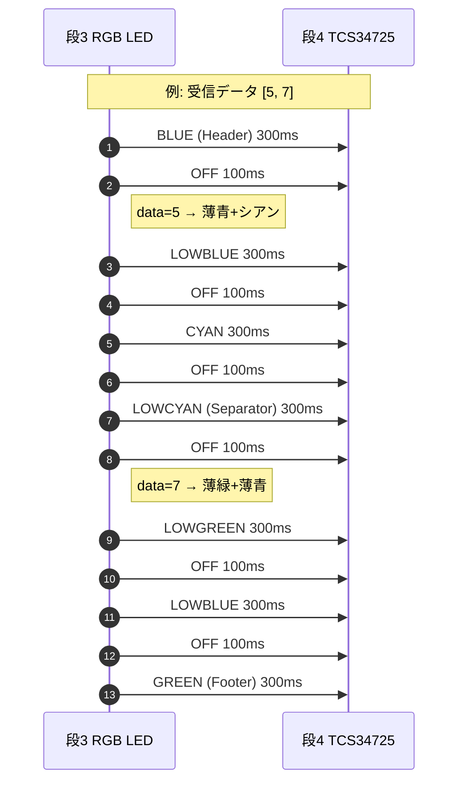

# ALiS システム構成図

このドキュメントは ALiS（A Light Information System）の構成・データフロー・プロトコル・タイミング・状態遷移を図示したものです。

---

## 1. 全体データフロー（Mermaid）

```mermaid
flowchart LR
    USER([ユーザー入力<br/>文字列]):::user

    subgraph S1["段1: Proc01_Encode_IS1<br/>(Arduino + L6470)"]
        E1[符号化テーブル<br/>8×8 glyph]
        E2[文字 → row,col]
        E3[ステッピングモータ<br/>位置=距離mm]
    end

    subgraph S2["段2: Proc02_IC1_LM2<br/>(Arduino)"]
        D1[赤外線距離センサ<br/>A0]
        D2[閾値th 0..7判定]
        D3[独自モールス変換<br/>Header/Footer付与]
        D4[レーザー D9]
    end

    subgraph S3["段3: Proc03_LM2_FS3<br/>(Arduino R4 WiFi)"]
        M1[フォトトランジスタ<br/>A0]
        M2[エッジ検出+<br/>デバウンス]
        M3[モールス→数字]
        M4[2色ペア生成]
        M5[RGB LED<br/>R=9 G=3 B=11]
    end

    subgraph S4["段4: Proc04_FS3_Decode<br/>(Arduino)"]
        F1[TCS34725<br/>カラーセンサ I2C]
        F2[色判定<br/>RGB+C 範囲]
        F3[状態機械<br/>HEADER→DATA→FOOTER]
        F4[復号テーブル<br/>row,col → 文字]
    end

    OUT([シリアルモニタ<br/>復元文字列]):::user

    USER --> E1 --> E2 --> E3
    E3 -. 赤外線/距離 .-> D1
    D1 --> D2 --> D3 --> D4
    D4 -. レーザー光モールス .-> M1
    M1 --> M2 --> M3 --> M4 --> M5
    M5 -. 可視光カラー .-> F1
    F1 --> F2 --> F3 --> F4 --> OUT

    classDef user fill:#fff3b0,stroke:#666;
```



---

## 2. プロトコルスタック概観（Mermaid）



---

## 3. ハードウェア接続図（Mermaid）

```mermaid
flowchart LR
    PC1[PC<br/>Serial 9600]
    A1[Arduino #1]
    L6470[L6470<br/>SPI MODE3 8MHz]
    SM[ステッピングモータ]
    IR[赤外線距離センサ]
    A2[Arduino #2]
    LASER[赤色レーザー]
    PT[フォトトランジスタ]
    A3[Arduino R4 WiFi]
    RGB[共通カソードRGB LED]
    TCS[TCS34725<br/>I2C]
    A4[Arduino #4]
    PC2[PC<br/>Serial 9600]

    PC1 -- USB/Serial --> A1
    A1 -- "SPI (D10..D13)" --> L6470
    L6470 -- 駆動 --> SM
    SM -. 物理距離 .-> IR
    IR -- A0 --> A2
    A2 -- D9 --> LASER
    LASER -. 光 .-> PT
    PT -- A0 --> A3
    A3 -- "D9/D3/D11 (PWM)" --> RGB
    RGB -. 光 .-> TCS
    TCS -- I2C SDA/SCL --> A4
    A4 -- USB/Serial --> PC2
```



---

## 4. 段4 受信側 状態機械（Mermaid）



---

## 5. 段2 モールス送信タイミング（Mermaid）

UNIT_TIME = 100 ms（送信側）。  
ドット = 1×UT、ダッシュ = 3×UT、符号間 = 1×UT、文字間 = 3×UT、語間/送信終了後 = 7×UT。



ドット/ダッシュ判別の受信側ウィンドウ:

| 種別     | 条件 (lightDuration) |
|----------|----------------------|
| ドット   | 0.7×UT 以上 2×UT 未満 |
| ダッシュ | 2.5×UT 以上 4×UT 以下 |
| 文字間   | OFF が 約3×UT (UT/2 ゆらぎ) |
| タイムアウト | OFF が 7×UT 以上 (バッファリセット) |

---

## 6. 段3 カラー送信タイミング（Mermaid）

LIGHT_ON_DURATION = 300 ms / INTERVAL_DURATION = 100 ms。



---

## 7. 符号化テーブル (8×8 glyph)

| row\col | 0 | 1 | 2 | 3 | 4 | 5 | 6 | 7 |
|---|---|---|---|---|---|---|---|---|
| 0 | A | B | C | D | E | F | G | H |
| 1 | I | J | K | L | M | N | O | P |
| 2 | Q | R | S | T | U | V | W | X |
| 3 | Y | Z | a | b | c | d | e | f |
| 4 | g | h | i | j | k | l | m | n |
| 5 | o | p | q | r | s | t | u | v |
| 6 | w | x | y | z | ! | ? | . | , |
| 7 | : | ; | - | _ | @ | $ | % | (空白) |

文字 1 つは (row, col) の 2 つの数字に符号化される。

---

## 8. 色コード ↔ データペア対応表

| コード | 名称 | 用途 | RGB (PWM) |
|---|---|---|---|
| 0 | RED | データ | 255, 0, 0 |
| 1 | LOWBLUE | データ | 0, 0, 128 |
| 2 | LOWGREEN | データ | 0, 128, 0 |
| 3 | CYAN | データ | 0, 255, 255 |
| 4 | BLUE | **ヘッダ** | 0, 0, 255 |
| 5 | GREEN | **フッタ** | 0, 255, 0 |
| 6 | LOWCYAN | **区切り** | 0, 128, 128 |

| データ値 | 1色目 | 2色目 |
|---|---|---|
| 0 | 赤 | 薄青 |
| 1 | 赤 | 薄緑 |
| 2 | 赤 | シアン |
| 3 | 薄青 | 赤 |
| 4 | 薄青 | 薄緑 |
| 5 | 薄青 | シアン |
| 6 | 薄緑 | 赤 |
| 7 | 薄緑 | 薄青 |

---

## 9. ASCII 全体図 (README 向け簡易版)

```
┌─────────────┐
│ ユーザー入力 │  例: "Hi!"
│  (文字列)   │
└──────┬──────┘
       │ Serial
       ▼
╔══════════════════════════════════════╗
║ 【段1】 Proc01_Encode_IS1            ║
║   符号化テーブル 8×8                 ║
║   文字 → (row,col) ペア              ║
║   L6470 → ステッピングモータ位置 mm  ║
╚══════════════╤═══════════════════════╝
               │ 物理的距離(赤外線反射)
               ▼
╔══════════════════════════════════════╗
║ 【段2】 Proc02_IC1_LM2                ║
║   赤外線センサ A0 → ADC値             ║
║   th[0..9] で 0-7 / 開始 / 終了 判定  ║
║   独自モールスに変換 + Header/Footer  ║
║   レーザー D9 で点滅送信              ║
╚══════════════╤═══════════════════════╝
               │ レーザー光モールス
               ▼
╔══════════════════════════════════════╗
║ 【段3】 Proc03_LM2_FS3                ║
║   フォトトランジスタ A0               ║
║   立ち上がり/立ち下がりエッジ検出     ║
║   ドット/ダッシュ → 数字 0-7          ║
║   2色ペアに割り付け、RGB LED で発光   ║
║   (R=D9, G=D3, B=D11)                ║
╚══════════════╤═══════════════════════╝
               │ 可視光カラーシーケンス
               ▼
╔══════════════════════════════════════╗
║ 【段4】 Proc04_FS3_Decode             ║
║   TCS34725 (I2C) で色取得             ║
║   RGB+C 範囲で色判定                  ║
║   状態機械でヘッダ/データ/フッタ識別   ║
║   2色ペア → 数字 → (row,col) → 文字   ║
╚══════════════╤═══════════════════════╝
               │ Serial
               ▼
       ┌──────────────┐
       │ 復元文字列   │  例: "Hi!"
       └──────────────┘
```

---

## 10. 関連ファイル

- 主要プログラム: `JoinProgram/Proc0{1..4}_*.ino`
- 個別モジュール: `DecryptionTable/`, `InfraredSensor/`, `LightMorse/`, `FullColorSensor/`
- PlantUML 版: [`architecture.puml`](./architecture.puml)
- Graphviz 版: [`architecture.dot`](./architecture.dot)
