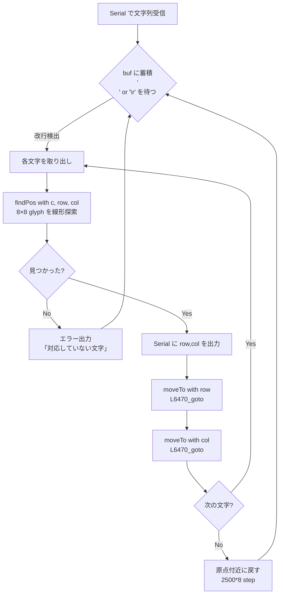
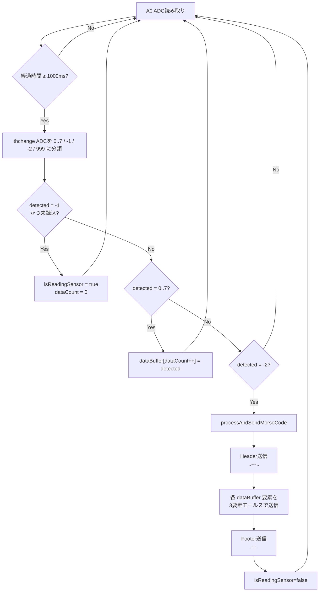
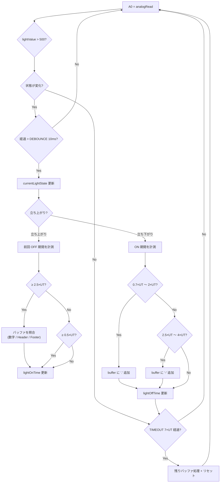
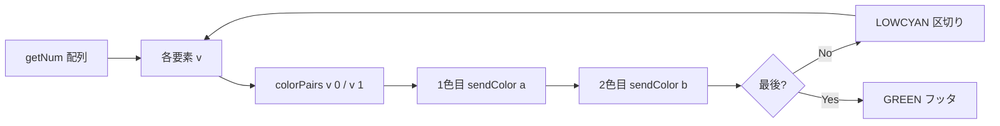
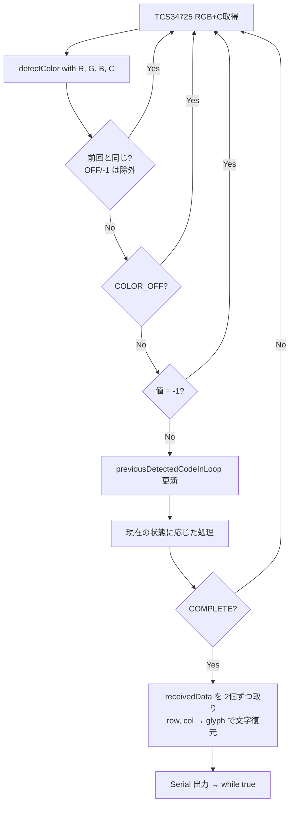

# ALiS 各段の詳細図

`architecture.md` の補足。各段のロジックを掘り下げた図を集めています。

---

## 1. 段1: 文字 → 距離 への変換フロー



**ステップ換算式 (`indexToStep`)**

```
mm[]      = {200, 250, 300, 350, 400, 450, 500, 600, 700}
steps     = mm[label] * 200 * 8 / 60
              = mm * 26.667 (step)
```

ラベル 0-8 が 8×8 テーブルの「行 or 列」に対応し、9 段階の物理距離に変換される。

---

## 2. 段2: 距離 → モールス への変換フロー



**閾値テーブル (ADC 値、上→下に距離が遠くなる前提)**

| 用途      | 値    |
|-----------|-------|
| 開始      | ≥ 550 |
| 数字 0    | > 525 |
| 数字 1    | 480〜525 |
| 数字 2    | 415〜480 |
| 数字 3    | 350〜415 |
| 数字 4    | 290〜350 |
| 数字 5    | 225〜290 |
| 数字 6    | 201〜225 |
| 数字 7    | 175〜201 |
| 終了      | ≤ 170 |

---

## 3. 段3: 受信側エッジ検出（モールス → 数字）



---

## 4. 段3: 数字 → 2色ペア送信フロー



注: `outputColorsFromGetNum()` の前にヘッダー色 (BLUE) が送信される。

---

## 5. 段4: 色 → 文字 への復号フロー



**状態ごとの遷移条件（Proc04 の switch ケースより）**

| 現状態 | 入力色 | 次状態 / 動作 |
|---|---|---|
| WAIT_FOR_HEADER | BLUE | RECEIVING_DATA_COLOR1 |
| WAIT_FOR_HEADER | その他 | 警告（同状態） |
| RECEIVING_DATA_COLOR1 | RED/LOWBLUE/LOWGREEN/CYAN | A=色, → COLOR2 |
| RECEIVING_DATA_COLOR1 | GREEN | COMPLETE |
| RECEIVING_DATA_COLOR1 | LOWCYAN/異常 | リセット |
| RECEIVING_DATA_COLOR2 | RED/LOWBLUE/LOWGREEN/CYAN | B=色, ペア確定 → SEPARATOR待ち |
| RECEIVING_DATA_COLOR2 | GREEN | COMPLETE |
| WAIT_FOR_DATA_SEPARATOR | LOWCYAN | COLOR1 |
| WAIT_FOR_DATA_SEPARATOR | GREEN | COMPLETE |

---

## 6. タイミング・チャート（モールス例「2」=「-.-」）

```
時刻(ms): 0   100  200  300  400  500  600  700  800  900  1000
LASER  : ███████████░░░░███░░░░███████████░░░░░░░░░░░░░░░░ (idle)
状態   : <───── - ─────><.><.. ↔ -><───── - ─────><── 文字間 ──>
                  300ms 100ms 100ms 100ms 300ms     300ms
```

UNIT_TIME を変える場合は送信側 `Send_Morse_EX.ino` の `UNIT_TIME` と受信側 `Receive_Morse_EX.ino` の `UNIT_TIME` を同値にする必要がある（受信ウィンドウは UNIT_TIME を基準に算出されるため）。

---

## 7. ファイル ↔ 段 対応早見表

| ファイル | 段 | 入力 | 出力 |
|---|---|---|---|
| `JoinProgram/Proc01_Encode_IS1/Proc01_Encode_IS1.ino` | 1 | Serial 文字列 | モータ位置 (距離 mm) |
| `JoinProgram/Proc02_IC1_LM2/Proc02_IC1_LM2.ino` | 2 | A0 ADC (赤外線) | D9 レーザー (モールス) |
| `JoinProgram/Proc03_LM2_FS3/Proc03_LM2_FS3.ino` | 3 | A0 (フォトTr) | D9/D3/D11 (RGB LED) |
| `JoinProgram/Proc04_FS3_Decode/Proc04_FS03_Decode.ino` | 4 | I2C (TCS34725) | Serial 出力 (文字) |
| `LightMorse/Send_Morse_EX/Send_Morse_EX.ino` | 単体 | Serial 数字列 | レーザー |
| `LightMorse/Receive_Morse_EX/Receive_Morse_EX.ino` | 単体 | フォトTr | Serial |
| `FullColorSensor/FC_EX/FC_SendColor_EX.ino` | 単体 | 固定 data[] | RGB LED |
| `FullColorSensor/FC_EX/FC_ReceiveColor_EX.ino` | 単体 | TCS34725 | Serial |
| `DecryptionTable/decryptionTable_encord/...` | 単体 | Serial 文字列 | row,col CSV |
| `DecryptionTable/decryptionTable_decode/...` | 単体 | row,col CSV | 文字 |
